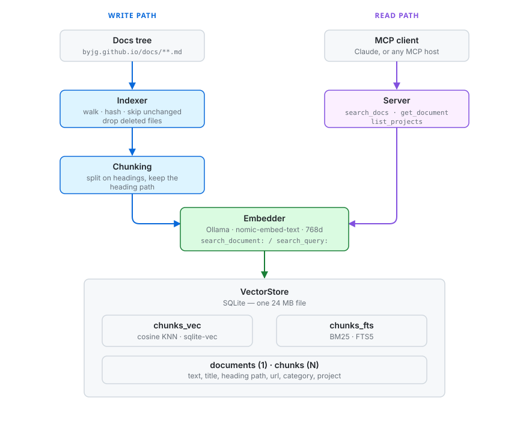
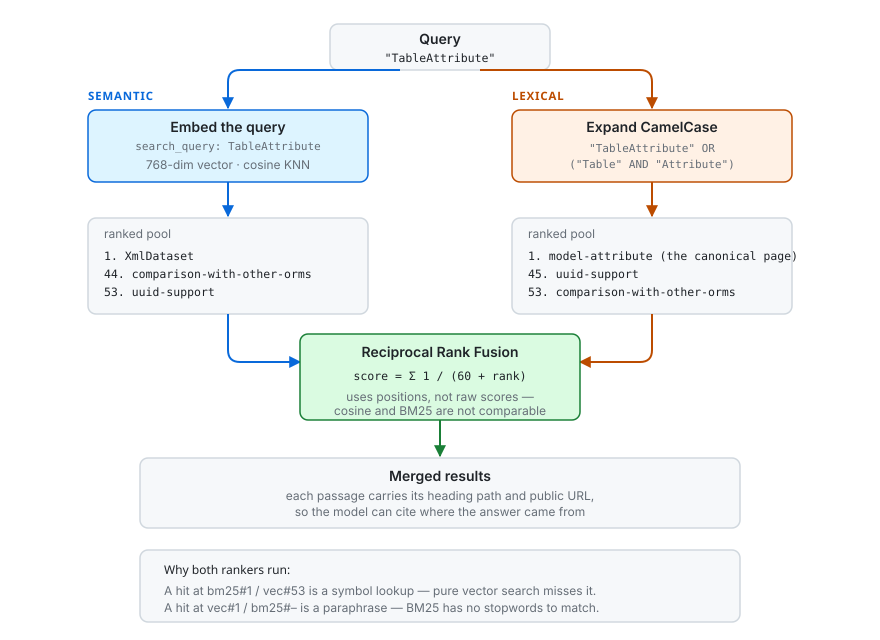

# Architecture

## What this is

A retrieval service over the ByJG documentation. It turns ~550 markdown files
into ~4,100 searchable passages and exposes them to an LLM through three MCP
tools. The LLM asks a question in natural language; it gets back passages with
their public URLs so it can cite them.

## The shape of the problem

Two numbers drove almost every decision:

| | Value |
|---|---|
| Documents | 549 markdown files |
| Passages after chunking | 4,136 |
| Vectors (768 dims, float32) | ~13 MB |
| Whole index on disk | 24 MB |

At this size a brute-force scan over every vector takes single-digit
milliseconds. That removes the usual reason to run a vector database: there is
no index to tune, no sharding, no approximate search trading recall for speed.
The corpus fits in a file.

So the architecture optimises for something else -- being easy to operate, easy
to reason about, and easy to replace piece by piece.

## Two paths through the system

Everything is either the **write path** (getting documents into the index) or
the **read path** (answering a query). They share the data model and nothing
else.



## Write path

### 1. Fetching

GitHub is the source of truth. Every refresh shallow-clones the repository into
a temporary directory, indexes it, and discards the checkout. There is no
permanent working copy anywhere on the server.

That costs ~22s of clone per refresh instead of a ~2s `git pull`, and removes
every failure mode a long-lived checkout brings: divergent local state,
ownership mismatches on a mounted volume, a half-updated tree after an
interrupted fetch, and the question of how the checkout gets there in the first
place. Nothing to initialise, nothing to back up.

It stays cheap because **incremental indexing keys on content, not on git**:
the indexer hashes each file's bytes, and a fresh clone reproduces those hashes
exactly. So a refresh after an unrelated push re-embeds nothing:

```
scanned=549 indexed=0 unchanged=544 empty=5 deleted=0 chunks=0
```

### 2. Discovery and change detection

`DocsIndexer` walks the docs tree and hashes each file. A document whose hash
already matches the stored one is skipped without being read further, so
re-running re-embeds nothing when the content has not changed -- the cost of a
no-op refresh is the clone, not the embedding. Files that disappeared from the
repository are deleted from the index in the same pass.

### 3. Chunking

`chunking.py` splits on markdown headings rather than fixed-size windows. A
heading marks a boundary the author already decided was meaningful, so chunks
come out as coherent sections instead of arbitrary slices.

Three things it has to get right:

- **Fenced code is tracked.** A `#` at the start of a shell comment is not a
  heading. Without this, a document with a bash snippet gets shredded.
- **Runt sections merge forward.** A heading with one line under it is not
  independently retrievable, so it joins its neighbour.
- **Oversized sections split.** A generated diagram or a wide table has no
  paragraph breaks to split on, so there is a hard ceiling enforced on line
  boundaries, then on characters.

Each chunk keeps its heading path (`Active Record > Pattern Overview`), which
is what makes a result citable.

### 4. Embedding

Each chunk is embedded **with its title and heading path prepended**. This
matters more than it looks: a chunk whose text is "Usage" followed by a code
sample carries no clue about which library it belongs to. Prefixing the context
puts it in the right neighbourhood of the vector space.

`nomic-embed-text` also requires task prefixes -- `search_document:` when
indexing, `search_query:` when searching. Documents and queries land in
different regions without them, which silently degrades recall.

### 5. Persistence

`replace_document` writes the document, its chunks, its vectors and its FTS
rows in **one transaction**. A document is never half-replaced. FTS5 and vec0
are virtual tables that do not participate in foreign-key cascades, so their
rows are deleted explicitly before the chunks they point at disappear.

## Read path

A query runs **two independent rankers** and fuses them.

### Why both

Pure vector search is weak at exact identifiers. Ask for `TableAttribute` and
the embedding lands you near anything about tables and attributes generally,
which is most of an ORM's documentation. BM25 nails it. Conversely, ask "how do
I map a database table to a PHP class" and BM25 flounders on stopwords while
the vector side answers immediately.

Measured on this corpus, the two rankers disagree constantly -- which is the
point. A hit ranked #1 by BM25 and #53 by vectors is usually a symbol lookup; a
hit ranked #1 by vectors and unranked by BM25 is usually a paraphrase.

### Reciprocal Rank Fusion

Each ranker returns an over-fetched pool. A chunk's score is the sum of
`1 / (60 + rank)` over the lists it appears in. RRF uses only *positions*, never
the raw scores, so it does not need cosine distance and BM25 to be on a
comparable scale -- they are not.



### CamelCase expansion

Technical docs are inconsistent about symbols on purpose: the reference page for
`TableAttribute` titles its section "Table Attributes parameters", while every
code sample writes `TableAttribute`. A query for one should find the other, so
identifiers expand to:

```
"TableAttribute" OR ("Table" AND "Attribute")
```

The `AND` keeps the spelled-out form from matching every page that merely says
"table".

## Components

| Module | Responsibility |
|---|---|
| `chunking.py` | Markdown → `(heading_path, text)` pairs. Pure, no I/O. |
| `indexer.py` | Walks the tree, derives URLs and scope, drives embedding and persistence. |
| `embeddings/` | `Embedder` interface + Ollama implementation. |
| `stores/` | `VectorStore` interface + SQLite implementation. |
| `runtime.py` | Wires config into concrete components. |
| `server.py` | The three MCP tools and the transports. |
| `sync.py` | Clone into a temporary directory → reindex → discard; one run at a time. |
| `webhook.py` | GitHub push → signature and path checks → triggers `sync`. `/healthz`. |
| `querylog.py` | One JSON line per tool call, to find what the docs do not cover. |
| `cli.py` | `build`, `search`, `stats`. |

The dependency arrows all point one way: `server` and `cli` depend on
`runtime`, which depends on the interfaces. Nothing depends on a concrete
backend except the registry that constructs it.

## Extension points

### Swapping the store

`VectorStore` (`stores/base.py`) is the whole storage contract -- nine methods.
Implement it, register it in `STORE_BACKENDS`, point
`BYJG_DOCS_STORE_BACKEND` at it. `BYJG_DOCS_INDEX_PATH` is passed through
verbatim, so it can carry a DSN instead of a file path.

`search()` receives **both** the query text and its vector. A backend uses
whichever it can: Qdrant would use the vector plus its own sparse index,
pgvector the vector plus `tsvector`, a lexical-only store would ignore the
vector entirely. The interface does not assume the SQLite design.

### Swapping the embedder

Same pattern via `EMBEDDER_BACKENDS`. `Embedder` deliberately separates
`embed_documents` from `embed_query` because models differ in how they treat
the two sides.

Changing the model changes the vector width, so the store is sized from
`embedder.dimensions` -- probed from the model, never hardcoded -- and refuses
vectors of the wrong size rather than corrupting the index silently.

### Indexing something other than docs

`DocsIndexer` owns discovery, URL derivation and scope. Indexing source code
would mean a sibling class producing `IndexedDocument`s with a code-aware
chunker; the store, the embedder and the server would not change.

## Design decisions and their costs

**SQLite instead of a vector database.** Wins: one file, no service, trivial
backup, hybrid search in one place. Cost: a brute-force KNN, which is fine at
4k chunks and would not be at 4M.

**Heading-based chunking instead of fixed windows.** Wins: coherent passages,
free citation metadata. Cost: chunk sizes vary a lot (3 to 4,000 chars), and
documents with poor heading structure chunk poorly.

**Truncation in the embedder instead of a character budget.** The context limit
is counted in tokens, and the token-to-character ratio is not predictable from
the text -- a base64 key blob costs ~1 token per 2 characters, prose closer to
1 per 4. Rather than guess a budget some future document would violate, the
embedder isolates an oversized input and shrinks it. Cost: a pathological chunk
is silently truncated; the title and heading path survive, so it stays findable.

**Cloning into a temporary directory instead of keeping a working copy.**
Wins: no state to initialise, migrate or back up; no way for the local tree to
drift from GitHub. Cost: ~22s of clone on every refresh, and a refresh needs
network even when nothing changed.

**Dropping concurrent webhook triggers instead of queueing them.** A burst of
pushes must not start overlapping clones. The clone in flight picks up the
newer commits anyway. Cost: a push landing microseconds after a reindex starts
waits for the next trigger.
