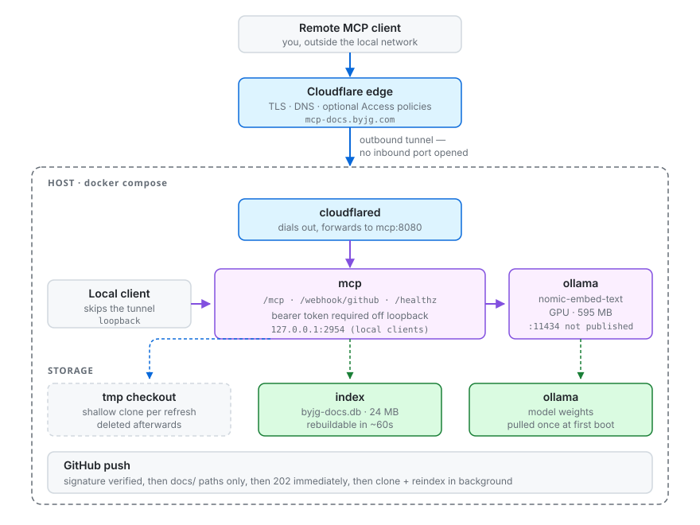

# Self-hosting

Run your own server with Docker Compose: Ollama, the MCP server over HTTP, the
GitHub webhook that keeps the index fresh, and optionally a Cloudflare Tunnel
to publish it. This is how `mcpdocs.byjg.com` runs.

To work on the code without Docker, see [Running locally](local.md) instead.

## Topology

Four containers. Ollama and the MCP server talk over the compose network;
`cloudflared` reaches the MCP server the same way and is the only thing exposed
to the internet.



The MCP server is published on port `2954` of the host so clients on this
machine or the LAN can reach it without going out to the internet and back.
Ollama is not published at all.

## The compose stack

`docker-compose.yml` defines four services:

| Service | What it does | Restarts |
|---|---|---|
| `ollama` | Serves embeddings on `:11434`. Reserves the host GPU. Not published -- only `mcp` reaches it, over the compose network. | always |
| `ollama-init` | Pulls `nomic-embed-text` into the shared volume, then exits. `mcp` waits for it to *complete successfully*. | never |
| `mcp` | The MCP server. Publishes port `2954` on the host; the tunnel reaches it internally. | always |
| `cloudflared` | Dials out to Cloudflare and forwards the public hostname to `mcp:8080`. Opt-in: only starts with `--profile tunnel`. | always |

and three named volumes:

| Volume | Holds | Safe to delete? |
|---|---|---|
| `ollama` | Model weights (~274 MB) | Yes -- `ollama-init` re-pulls |
| `index` | `byjg-docs.db` (24 MB) | Yes -- rebuilt in ~60s |
| `logs` | `queries.jsonl`, the [query log](#query-log) (at most 60 MB) | Yes, but the query history is gone |

There is no volume for the documentation: each refresh clones it from GitHub
into a temporary directory and deletes the checkout afterwards. The query log
is the only state that cannot be rebuilt, which is why it has a volume of its
own and the index stays disposable.

## Deploying

### Configure

```bash
git clone git@github.com:byjg/mcpserver-byjg-docs.git
cd mcpserver-byjg-docs
cp .env.example .env
openssl rand -hex 32     # paste into BYJG_DOCS_AUTH_TOKEN
openssl rand -hex 32     # paste into BYJG_DOCS_WEBHOOK_SECRET
```

| Variable | Value | Required? |
|---|---|---|
| `BYJG_DOCS_AUTH_TOKEN` | `openssl rand -hex 32` | Yes -- compose refuses to start without it |
| `BYJG_DOCS_PUBLIC_URL` | the address clients actually use | Yes -- same reason |
| `BYJG_DOCS_WEBHOOK_SECRET` | a *second*, different `openssl rand -hex 32` | Only for the webhook; empty disables it |
| `CLOUDFLARE_TUNNEL_TOKEN` | from Zero Trust > Networks > Tunnels | Only with `--profile tunnel` |

`BYJG_DOCS_PUBLIC_URL` is the tunnel hostname if you have one, otherwise this
machine's address (e.g. `http://<host-ip>:2954`). Why it must match, and every
other setting: [Configuration](configuration.md).

### Start

```bash
docker compose pull mcp
docker compose up -d
```

That starts `ollama`, `ollama-init` and `mcp`, using the published
`byjg/mcpserver-byjg-docs:latest` image (see [Updating](#updating)). The
tunnel is **opt-in**:

```bash
docker compose --profile tunnel up -d     # adds cloudflared
```

Skip the profile if you run `cloudflared` on the host, or reach the server over
the LAN only; `CLOUDFLARE_TUNNEL_TOKEN` can stay empty in that case.

Compose refuses to start if a required secret is unset, rather than booting
something half-configured:

```
error while interpolating services.mcp.environment.BYJG_DOCS_AUTH_TOKEN:
required variable BYJG_DOCS_AUTH_TOKEN is missing a value: set it in .env
```

### First boot

Nothing to initialise. The `mcp` container starts with an empty index volume,
notices it is empty, clones `byjg.github.io` into a temporary directory, builds
the index in the background, and serves `/healthz` throughout:

```bash
curl -s http://127.0.0.1:2954/healthz
# {"status":"ok","reindexing":true,"documents":327,"chunks":2361}
# {"status":"ok","reindexing":false,"documents":544,"chunks":4136}
```

Measured on an RTX 2000 Ada: **~90s**, of which ~22s is the clone.

### Startup ordering

`ollama-init` pulls the embedding model into the shared volume and exits;
`mcp` waits for it to complete successfully. Without that gate the server would
come up before the model existed and fail its first embedding call.

### Running a subset

The services are independent enough to run partially. Without a tunnel token
you can still run everything else and reach it on the host port:

```bash
docker compose up -d ollama mcp      # skip cloudflared
```

### Updating

The Build workflow publishes the image on every push to `main` (`latest`) and
every tag (`1.2.3`), after the tests pass. To update a running stack:

```bash
docker compose pull mcp
docker compose up -d mcp
```

The index volume survives; the new container reuses it. To pin a release
instead of following `main`, change `image:` in `docker-compose.yml` to a
version tag.

To run local, unpublished changes, build this checkout instead:

```bash
docker compose up -d --build mcp
```

## GPU

The `ollama` service reserves the host GPU. This needs
`nvidia-container-toolkit` on the host -- the NVIDIA driver alone is not
enough, because Docker needs a runtime that can pass the device through.

Verify before deploying:

```bash
docker run --rm --gpus all nvidia/cuda:12.4.0-base-ubuntu22.04 nvidia-smi
```

If that fails with `failed to discover GPU vendor from CDI`, install the
toolkit ([NVIDIA's guide](https://docs.nvidia.com/datacenter/cloud-native/container-toolkit/latest/install-guide.html)):

```bash
curl -fsSL https://nvidia.github.io/libnvidia-container/gpgkey \
  | sudo gpg --yes --dearmor -o /usr/share/keyrings/nvidia-container-toolkit-keyring.gpg
curl -s -L https://nvidia.github.io/libnvidia-container/stable/deb/nvidia-container-toolkit.list \
  | sed 's#deb https://#deb [signed-by=/usr/share/keyrings/nvidia-container-toolkit-keyring.gpg] https://#g' \
  | sudo tee /etc/apt/sources.list.d/nvidia-container-toolkit.list
sudo apt-get update && sudo apt-get install -y nvidia-container-toolkit
sudo nvidia-ctk runtime configure --runtime=docker
sudo systemctl restart docker
```

### Does it need a GPU?

No. It changes indexing cost, not whether it works:

| | Embedding the full corpus | Single query embedding |
|---|---|---|
| GPU (RTX 2000 Ada) | ~40s | ~15ms |
| CPU only | ~30min | ~100-150ms |

(Add ~22s of clone to get the end-to-end refresh time.)

Query latency is what a user feels, and it survives CPU fine. The 45x gap only
bites on a full rebuild. If you index rarely, drop the `deploy.resources`
block from the `ollama` service and run on CPU.

### Memory

`nomic-embed-text` is 137M parameters -- **595 MB** resident. The index is
24 MB. The whole stack fits comfortably in 2 GB.

## Cloudflare Tunnel

The tunnel dials **out** from the host, so no inbound port is opened and the
host needs no public IP. In Zero Trust > Networks > Tunnels, create a tunnel,
copy its token into `CLOUDFLARE_TUNNEL_TOKEN`, and map a public hostname to
`http://mcp:8080`. Then start it with `docker compose --profile tunnel up -d`;
without the profile the service is not created at all.

Set `BYJG_DOCS_PUBLIC_URL` to that hostname. MCP's auth model advertises the
protected resource under this URL, so a mismatch breaks client authentication.

## Network exposure

Three things are easy to confuse. They are independent:

| Setting | Controls | Value |
|---|---|---|
| `BYJG_DOCS_HOST` | Where the process listens *inside* the container | `0.0.0.0` -- must be, or `cloudflared` could not reach it |
| `ports:` in compose | Which host interface publishes the port | `BYJG_DOCS_BIND_ADDR`, default `0.0.0.0` |
| Cloudflare Tunnel | Access from outside the network | Reaches `mcp:8080` over the compose network |

**The tunnel does not use the published port.** `cloudflared` resolves `mcp`
on the compose network, so the tunnel works even with `ports:` removed
entirely. Publishing is purely for clients on this machine or the LAN.

The default publishes on `0.0.0.0`, so other machines on your network connect
directly by IP -- faster than going out to Cloudflare and back, and it keeps
working if your internet does not:

```bash
curl -s http://<host-ip>:2954/healthz
```

Set `BYJG_DOCS_BIND_ADDR=127.0.0.1` to restrict it to this machine.

### What actually protects the port

The bearer token, and only the bearer token.

**A host firewall does not.** Docker publishes ports by writing iptables rules
in its own chain, which is evaluated before ufw's. On a machine with ufw
active and denying incoming traffic, a published port is still reachable from
the LAN -- verified, not assumed. So:

- Treat `BYJG_DOCS_AUTH_TOKEN` as the only barrier, and generate it with
  `openssl rand -hex 32` rather than picking something memorable.
- Check what can route to this host. If it has a public IP, or a forwarded
  port on the router, `0.0.0.0` means the internet, not just your LAN.
- `/healthz` answers without a token by design, exposing only document and
  chunk counts. The MCP endpoint itself returns 401 without a valid token.

If you want the firewall to be meaningful here, bind to `127.0.0.1` and let
the tunnel be the only way in.

## Authentication

Two independent layers:

1. **Cloudflare Access** (optional, at the edge) -- policies before a request
   ever reaches the host.
2. **Bearer token** (in the app) -- `StaticTokenVerifier`, compared in constant
   time so a wrong token cannot be recovered by timing.

The server refuses to bind a non-loopback address without a token, so the
second layer cannot be forgotten.

This is deliberately minimal: one pre-shared token for a read-only service.
More than one consumer with per-user revocation wants real OAuth via the SDK's
`auth_server_provider`.

## Keeping the index fresh

`POST /webhook/github` reindexes when documentation changes. The compose stack
enables it automatically, because it sets both variables the endpoint needs
(`BYJG_DOCS_TRANSPORT=http` in the image, `BYJG_DOCS_WEBHOOK_SECRET` from your
`.env`).

Configure a webhook on `byjg/byjg.github.io`:

| Field | Value |
|---|---|
| Payload URL | `https://<your-hostname>/webhook/github` |
| Content type | `application/json` |
| Secret | your `BYJG_DOCS_WEBHOOK_SECRET` |
| Events | Just the push event |

What the endpoint does, in order:

1. **Verifies `X-Hub-Signature-256`.** Absent or malformed is a rejection, never
   a pass. Without this, anyone could trigger reindexing.
2. **Filters by path.** The site repo also holds the Docusaurus app, CI config
   and blog. A push touching no `docs/` path is ignored -- rebuilding for a
   `package-lock.json` bump is waste.
3. **Returns 202 immediately** and refreshes in a background thread: the clone
   plus reindex takes longer than GitHub's delivery timeout.
4. **Drops overlapping triggers.** A burst of pushes must not start concurrent
   clones; the run already in flight picks up the newer commits.

Confirm the endpoint is registered:

```bash
curl -s -o /dev/null -w '%{http_code}\n' -X POST http://127.0.0.1:2954/webhook/github -d '{}'
# 401  -- registered, and rejecting an unsigned request
# 404  -- not registered: BYJG_DOCS_WEBHOOK_SECRET is empty
```

Verify a delivery end to end:

```bash
BODY='{"commits":[{"added":[],"modified":["docs/php/micro-orm/a.md"],"removed":[]}]}'
SIG=$(printf '%s' "$BODY" | openssl dgst -sha256 -hmac "$BYJG_DOCS_WEBHOOK_SECRET" -hex | sed 's/^.* //')
curl -s -X POST http://127.0.0.1:2954/webhook/github \
  -H "X-GitHub-Event: push" -H "X-Hub-Signature-256: sha256=$SIG" \
  -H "Content-Type: application/json" -d "$BODY"
# {"status":"reindexing"}
```

## Connecting clients

### Over the network

Follow [Connecting a client](../clients.md), with two substitutions: your
`BYJG_DOCS_PUBLIC_URL` plus `/mcp` in place of `https://mcpdocs.byjg.com/mcp`,
and your `BYJG_DOCS_AUTH_TOKEN` in place of `<TOKEN>`.

### From the same machine, over stdio

A client on the host running the stack can skip the token and the network:
`docker exec` starts a stdio server inside the running `mcp` container.

```bash
claude mcp add --scope user byjg-docs -- \
  docker exec -i -e BYJG_DOCS_TRANSPORT=stdio mcpserver-byjg-docs-mcp-1 byjg-docs-mcp
```

For a client configured through a form or a JSON file:

| Field | Value |
|---|---|
| Command | `/usr/bin/docker` -- the full path, since GUI apps often lack your shell's `PATH` |
| Arguments | `exec -i -e BYJG_DOCS_TRANSPORT=stdio mcpserver-byjg-docs-mcp-1 byjg-docs-mcp` |

- `-i` keeps stdin open; the protocol runs over it. Do not add `-t` -- a TTY
  mangles the stream.
- `BYJG_DOCS_TRANSPORT=stdio` overrides the `http` the container runs with.
- The process shares the container's index volume and reaches Ollama at
  `ollama:11434`, so nothing is built on the host. It never triggers a reindex;
  the long-running HTTP server keeps the index fresh.
- No bearer token: stdio does not pass through HTTP authentication, and anyone
  who can run `docker exec` already controls the container.
- The stack must be up. `mcpserver-byjg-docs-mcp-1` comes from the project
  directory name -- if you cloned into a different directory, check
  `docker compose ps` for the actual name.

To search from the terminal, run the CLI in the container:

```bash
docker exec mcpserver-byjg-docs-mcp-1 byjg-docs-index search "soft delete" -n 3
```

## Operations

```bash
docker compose ps
docker compose logs -f mcp
curl -s http://127.0.0.1:2954/healthz
docker compose restart mcp
```

`/healthz` reports liveness, whether a reindex is running, and the current
document and chunk counts -- enough to distinguish "empty index" from "still
building" from "healthy".

### Rebuilding from scratch

```bash
docker compose down
docker volume rm mcpserver-byjg-docs_index
docker compose up -d      # notices the empty index and rebuilds it
```

### Query log

Every tool call is appended to `/data/logs/queries.jsonl` in the `logs`
volume, one JSON object per line:

```json
{"ts": "2026-09-11T16:20:03+00:00", "tool": "search_docs", "query": "soft delete", "limit": 8, "category": null, "project": null, "hits": 8, "top_score": 0.0325, "top_vec_rank": 1, "top_bm25_rank": 2, "sources": ["php/micro-orm/softdelete.md", "..."]}
{"ts": "2026-09-11T16:20:09+00:00", "tool": "get_document", "source_path": "php/micro-orm/softdelete.md", "found": true}
```

Its purpose is finding what the documentation does not cover. The signals:

- **`hits: 0`** -- nothing matched at all (usually a `category`/`project`
  filter with nothing behind it).
- **A low `top_score`** -- something came back, but nothing matched well.
  Scores are Reciprocal Rank Fusion values: a hit ranked first by both rankers
  scores about 0.033. Judge "low" from your own data rather than a fixed
  number.
- **`top_bm25_rank: null`** -- only the vector ranker found the best hit: the
  words of the query appear nowhere in the docs. Expected for paraphrases,
  suspicious for a symbol name.
- **`get_document` with `found: false`** -- the model asked for a page that
  does not exist.

The image has no `jq`, so stream the file out and filter on the host
(`queries.jsonl*` includes the rotated files):

```bash
qlog() { docker exec mcpserver-byjg-docs-mcp-1 sh -c 'cat /data/logs/queries.jsonl*'; }

# Queries that found nothing
qlog | jq -c 'select(.tool=="search_docs" and .hits==0) | .query'

# Weakest searches first
qlog | jq -r 'select(.tool=="search_docs" and .hits>0) | [.top_score, .query] | @tsv' | sort -n | head -20

# Best hit found only by the vector ranker
qlog | jq -c 'select(.tool=="search_docs" and .hits>0 and .top_bm25_rank==null) | .query'
```

The file rotates at 10 MB and keeps five old files (`queries.jsonl.1` to
`.5`), so it never grows past about 60 MB. A client using
[the stack over stdio](#from-the-same-machine-over-stdio) inherits the
setting and writes to the same file.

> **Privacy:** queries can contain pieces of the user's own code or questions.
> The log stays in the volume on this host; nothing sends it anywhere.

To turn it off, remove the `BYJG_DOCS_QUERY_LOG` line from
`docker-compose.yml`. Running from source it is off unless
`BYJG_DOCS_QUERY_LOG` names a file.

### Backup

The index is one file inside the `index` volume, fully derived from a public
git repository, and rebuilt in ~60s. There is nothing there worth backing up
that GitHub does not already hold. The only state worth keeping is the query
log in the `logs` volume, and losing it costs history, not service.

## Data flows

Worth knowing given the tunnel exposes this publicly:

- **Documentation content** is cloned from a public repo on each refresh,
  embedded by a local Ollama, and stored in a local file. The checkout is
  temporary and deleted afterwards.
- **Query text** goes to the local Ollama only, and into the query log on
  this host. No embedding provider sees it.
- **What crosses the internet** is the MCP request and response through the
  Cloudflare tunnel, and the `git clone` of the public docs repo.
